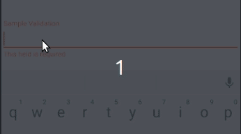

# Android Forms Made Easy
> **NOTE:** this library only works with [AndroidX](https://developer.android.com/jetpack/androidx/migrate):



**First import this dependencies to your build.gradle app level**
```` groovy
//Android Forms implementation
implementation 'com.hurtado.forms:AndroidForms:1.3.2'
````

# Form Group 

First add your **FromGroup** to your **XML file** this will be your containter
for all your form fields.

This class inherits from **ConstraintLayout** meaning the same rules will apply 
as if you were using it as a parent.

```` xml
<?xml version="1.0" encoding="utf-8"?>
<com.hurtado.forms.widget.FormGroup
        xmlns:android="http://schemas.android.com/apk/res/android"
        xmlns:app="http://schemas.android.com/apk/res-auto"
        android:orientation="vertical"
        android:layout_width="match_parent"
        android:layout_height="match_parent">

</com.hurtado.forms.widget.FormGroup>
````

# InputCompatField

Now that we have our parent class lets start adding our **FormField's**,
a **InputCompatField** is just a fancy name for a **TextInputLayout**, with just
enough extra code to make things work.

And of course we will need a **TextInputEditText** inside our **FormField**

```` xml
<?xml version="1.0" encoding="utf-8"?>
<com.hurtado.forms.widget.FormGroup
        xmlns:android="http://schemas.android.com/apk/res/android"
        xmlns:app="http://schemas.android.com/apk/res-auto"
        android:orientation="vertical"
        android:id="@+id/form_group"
        android:layout_width="match_parent"
        android:layout_height="match_parent">

    <com.hurtado.forms.widget.InputCompatField
            android:id="@+id/input_layout"
            android:layout_width="match_parent"
            android:layout_height="wrap_content"
            app:layout_constraintStart_toStartOf="parent"
            app:layout_constraintHorizontal_bias="0.5"
            app:layout_constraintEnd_toEndOf="parent"
            app:layout_constraintTop_toTopOf="parent"
            app:layout_constraintBottom_toBottomOf="parent">

        <com.google.android.material.textfield.TextInputEditText
                android:hint="@string/sample_validation"
                android:id="@+id/edit_text"
                android:layout_width="match_parent"
                android:layout_height="wrap_content"/>
    </com.hurtado.forms.widget.InputCompatField>

</com.hurtado.forms.widget.FormGroup>
````
# Validations 
> **NOTE:** Make sure your validation InputType matched with your field child's InputType
You will need to create an array of validations for your **FormField** to read,
decalre it on your **strings.xml** file, you can add as many as you want.

```` xml
<resources>

    <array name="sample_input_requirements">
        <item>com.hurtado.forms.validations.RequiredValidation</item>
        <item>com.hurtado.forms.validations.MaxCharValidation</item>
        <item>com.hurtado.forms.validations.SymbolsValidation</item>
    </array>

</resources>

````

# Pre-built Validations
> **Note:** Do not add the same validation twice on your validations array, you will get an exception... //TODO maybe fix this someday ¯\_(ツ)_/¯

```` com.hurtado.forms.validations.MaxCharValidation````

```` com.hurtado.forms.validations.MinCharValidation````

```` com.hurtado.forms.validations.EmailValidation````

```` com.hurtado.forms.validations.SymbolsValidation````

```` com.hurtado.forms.validations.RequiredValidation````

check com.hurtado.forms.validations package to see all of them


# Adding validation to your fields
> **Note:** as you may guess InputCompatField is not the only pre built field

Add ```` app:validations="@array/sample_input_requirements"" ```` to your **InputCompatField** 
also a **FormButton** inside your **FormGroup** and it will be **enable / disable**
Automatically depending on the form status **Valid / Invalid**

```` xml
<?xml version="1.0" encoding="utf-8"?>
<com.hurtado.forms.widget.base.FormGroup xmlns:android="http://schemas.android.com/apk/res/android"
    xmlns:app="http://schemas.android.com/apk/res-auto"
    xmlns:tools="http://schemas.android.com/tools"
    android:id="@+id/form_group"
    android:layout_width="match_parent"
    android:layout_height="match_parent"
    android:orientation="vertical">

    <com.hurtado.forms.widget.InputCompatField
        android:id="@+id/name_layout"
        android:layout_width="match_parent"
        android:layout_height="wrap_content"
        android:layout_marginTop="16dp"
        app:errorEnabled="true"
        app:layout_constraintBottom_toTopOf="@+id/switchCompatField2"
        app:layout_constraintHorizontal_bias="0.5"
        app:layout_constraintTop_toTopOf="parent"
        app:validations="@array/sample_input_requirements">

        <com.google.android.material.textfield.TextInputEditText
            android:id="@+id/input"
            android:layout_width="match_parent"
            android:layout_height="wrap_content"
            android:hint="Input"
            tools:ignore="HardcodedText" />
    </com.hurtado.forms.widget.InputCompatField>

    <com.hurtado.forms.widget.SwitchCompatField
        android:id="@+id/switchCompatField2"
        android:layout_width="match_parent"
        android:layout_height="wrap_content"
        android:layout_marginTop="16dp"
        app:layout_constraintBottom_toTopOf="@+id/checkBoxCompatField2"
        app:layout_constraintHorizontal_bias="0.5"
        app:layout_constraintTop_toBottomOf="@+id/name_layout"
        app:validations="@array/sample_switch_requirements">

        <androidx.appcompat.widget.SwitchCompat
            android:id="@+id/switchChild"
            android:layout_width="match_parent"
            android:layout_height="match_parent"
            android:text="Switch"
            tools:ignore="HardcodedText" />
    </com.hurtado.forms.widget.SwitchCompatField>

    <com.hurtado.forms.widget.CheckBoxCompatField
        android:id="@+id/checkBoxCompatField2"
        android:layout_width="match_parent"
        android:layout_height="wrap_content"
        android:layout_marginTop="16dp"
        app:layout_constraintBottom_toTopOf="@+id/calendarCompatField2"
        app:layout_constraintHorizontal_bias="0.5"
        app:layout_constraintTop_toBottomOf="@+id/switchCompatField2"
        app:validations="@array/sample_switch_requirements">

        <androidx.appcompat.widget.AppCompatCheckBox
            android:id="@+id/checkBox"
            android:layout_width="match_parent"
            android:layout_height="wrap_content"
            android:text="Check Box"
            tools:ignore="HardcodedText" />
    </com.hurtado.forms.widget.CheckBoxCompatField>

    <com.hurtado.forms.widget.CalendarCompatField
        android:id="@+id/calendarCompatField2"
        android:layout_width="match_parent"
        android:layout_height="wrap_content"
        android:layout_marginTop="16dp"
        app:errorEnabled="true"
        app:layout_constraintBottom_toTopOf="@+id/timeCompatField2"
        app:layout_constraintHorizontal_bias="0.5"
        app:layout_constraintTop_toBottomOf="@+id/checkBoxCompatField2"
        app:validations="@array/sample_calendar_requirements">

        <com.google.android.material.textfield.TextInputEditText
            android:id="@+id/date"
            android:layout_width="match_parent"
            android:layout_height="wrap_content"
            android:drawableStart="@drawable/ic_date"
            android:drawablePadding="8dp"
            android:focusable="false"
            android:hint="Pick Date"
            tools:ignore="HardcodedText,RtlCompat" />
    </com.hurtado.forms.widget.CalendarCompatField>

    <com.hurtado.forms.widget.TimeCompatField
        android:id="@+id/timeCompatField2"
        android:layout_width="match_parent"
        android:layout_height="wrap_content"
        android:layout_marginTop="16dp"
        app:errorEnabled="true"
        app:layout_constraintBottom_toTopOf="@+id/button"
        app:layout_constraintHorizontal_bias="0.5"
        app:layout_constraintTop_toBottomOf="@+id/calendarCompatField2"
        app:validations="@array/sample_time_requirements">

        <com.google.android.material.textfield.TextInputEditText
            android:id="@+id/time"
            android:layout_width="match_parent"
            android:layout_height="wrap_content"
            android:drawableStart="@drawable/ic_time"
            android:drawablePadding="8dp"
            android:focusable="false"
            android:hint="Pick Time"
            tools:ignore="HardcodedText,RtlCompat" />
    </com.hurtado.forms.widget.TimeCompatField>

    <com.hurtado.forms.widget.base.FormButton
        android:id="@+id/button"
        android:layout_width="match_parent"
        android:layout_height="50dp"
        android:backgroundTint="@color/colorPrimary"
        android:text="@string/submit_form"
        app:layout_constraintBottom_toBottomOf="parent"
        app:layout_constraintEnd_toEndOf="parent"
        app:layout_constraintHorizontal_bias="0.5"
        app:layout_constraintStart_toStartOf="parent"
        app:layout_constraintTop_toBottomOf="@+id/timeCompatField2"
        tools:targetApi="lollipop" />

</com.hurtado.forms.widget.base.FormGroup>
````
# Object Mapping

Now add your custom object **matching your Field Child's id with your properties names, 
also make sure your properties are public and mutable)**
and implement FormResult interface to it

```` kotlin
class SampleForm(
    var time: Date,
    var date: Date,
    var switch: Boolean,
    var checkBox: Boolean,
    var input: String
) : FormResult {
    constructor() : this(
        Date(),
        Date(),
        false,
        false,
        ""
    )
}
````
Add a From FormGroup.CompleteListener<SampleForm> to your Form Group and you will get your custom object filled out
with the form input and validated as soon as your form is valid and you have click on the form button (android:id="@+id/button"), if you are not using a button
inside your form you can force the completion with **sampleForm.forceComplete()**
        
```` kotlin
class MainActivity : AppCompatActivity(), FormGroup.CompleteListener<SampleForm> {

    private lateinit var sampleForm: FormGroup<SampleForm>

    override fun onCreate(savedInstanceState: Bundle?) {
        super.onCreate(savedInstanceState)
        setContentView(R.layout.activity_main)

        sampleForm = findViewById(R.id.form_group)
        sampleForm.setOnCompleteListener(
            this,
            SampleForm()
        )
    }

    override fun onDestroy() {
        sampleForm.onDestroy()
        // clear your form to avoid memory leaks
        super.onDestroy()
    }

    override fun onFormComplete(result: SampleForm) {
        Log.d("RESULT", result.toString())
    }
}
````

# Creating custom validations
It's great to have some prebuilt validations on our forms, but what if we would like
something custom ?

Extend Validation class and override onValidate to test users input agains your own logic

```` kotlin
package com.hurtado.validation.validations

import ...
import ...

class CustomValidation: Validation(R.string.custom_error) {

    override fun onValidate(context: Context?, value: String): String? {
        // Error is triggered if input contains letter A
        return if (value.contains("A"))
            super.onValidate(context, value)
        else
            null
    }
}
````

Also add it to your validations array of course using your own package name

```` xml
<resources>
    <string name="app_name">validation</string>

    ...
    ...
    ...

    <array name="sample_field_requirements">
        ...
        ...
        <item>com.hurtado.validation.validations.CustomValidation</item>
    </array>

</resources>
````
# Creating custom Fields
Create your own field by extending from FormField<ChildInputType, ChildClassType>
> **NOTE:** Dsicrete slider class obtained from -> "com.github.hearsilent:DiscreteSlider:1.1.2"

```` kotlin
class SliderField(context: Context, attrs: AttributeSet) :
    FormField<Int, DiscreteSlider>(context, attrs, DiscreteSlider::class) {
    override fun controller(host: (FormController<Int, DiscreteSlider>) -> Unit) =
        SliderController(this, host)
}
````

Now create your fields controller, assertFieldValidity(input) using your own logic
```` kotlin
class SliderController(
    action: Field<Int, DiscreteSlider>,
    callback: (FormController<Int, DiscreteSlider>) -> Unit
) : Controller<Int, DiscreteSlider>(action, callback) {

    private var input = 300

    override fun onCreate() {
        action.child().setOnValueChangedListener(object :
            DiscreteSlider.OnValueChangedListener() {
            override fun onValueChanged(progress: Int, fromUser: Boolean) {
                input = progress
                assertFieldValidity(input)
                super.onValueChanged(progress, fromUser)
            }
        })
    }

    override fun isValid() = true

    override fun input() = input
}
````


**And that's it, now you have your custom Field !!**
```` xml
<SliderField
            android:id="@+id/income"
            app:layout_constraintHorizontal_bias="0.5"
            app:layout_constraintEnd_toEndOf="parent"
            app:layout_constraintStart_toStartOf="parent"
            app:layout_constraintTop_toBottomOf="@+id/min_income"
            android:layout_width="match_parent"
            android:layout_height="wrap_content">

            <hearsilent.discreteslider.DiscreteSlider
                android:layout_width="match_parent"
                android:layout_height="wrap_content"
                app:ds_minProgress="300"
                app:ds_count="3000"
                app:ds_mode="normal"
                app:ds_progress="400"
                app:ds_thumbColor="@color/colorOrangeAccent"
                app:ds_thumbPressedColor="@color/colorOrangeTranslucent"
                app:ds_thumbRadius="6dp"
                app:ds_trackColor="@color/colorOrangeAccent"
                app:ds_trackWidth="2dp"
                app:ds_valueLabelTextColor="@color/colorWhite"
                app:ds_valueLabelTextSize="14sp"
                onValueChanged="@{(progress) -> viewModel.onValueChanged(progress)}"
                app:ds_inactiveTrackColor="@color/colorInactiveSeekBar"/>
</SliderField>
````        
> **NOTE:** Please also check our fully functional example on this repo
# Happy Coding  :beers:
